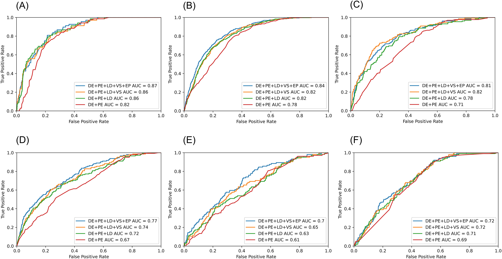
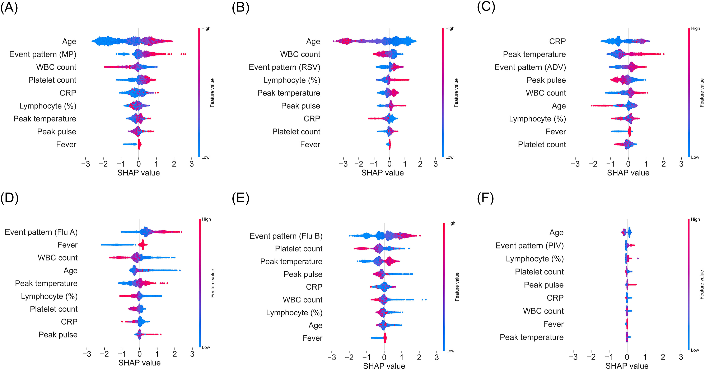

# Machine Learning for Pediatric Pneumonia

Published research on machine learning approaches for clinical prediction in pediatric pneumonia, including respiratory pathogen identification and intensive care unit (ICU) mortality risk assessment.

## Research Overview

This repository presents two collaborative machine learning research studies conducted with National Taiwan University Hospital and National Taiwan University.

The studies investigated the application of machine learning to structured clinical data and electronic health records (EHR) to support predictive assessment and clinical decision-making in pediatric respiratory diseases.

**Research Areas:** Clinical Data Science, Predictive Modeling, Electronic Health Records (EHR), Machine Learning, Healthcare Analytics

---

## Publication 1: Respiratory Pathogen Prediction

### Publication

**Clinical characteristics of hospitalized children with community-acquired pneumonia and respiratory infections: Using machine learning approaches to support pathogen prediction at admission**

Tu-Hsuan Chang, Yun-Chung Liu, Siang-Rong Lin, Pei-Hsin Chiu, et al.

*Journal of Microbiology, Immunology and Infection*, 56(4), 772–781 (2023).

- [Published Paper](https://doi.org/10.1016/j.jmii.2023.04.011)
- [PubMed](https://pubmed.ncbi.nlm.nih.gov/37246060/)

### Research Objective

Investigate machine learning approaches for predicting respiratory pathogens using clinical information available at hospital admission.

The study aimed to support early pathogen identification by analyzing clinical characteristics of hospitalized pediatric patients with community-acquired pneumonia and respiratory infections.

### Methodology

- **Task:** Respiratory pathogen prediction
- **Domain:** Pediatric pneumonia and respiratory infections
- **Data:** Clinical characteristics of hospitalized pediatric patients
- **Approach:** Machine learning-based predictive modeling and quantitative analysis
- **Machine Learning:** XGBoost-based pathogen prediction and feature importance analysis
- **Feature Analysis:** Comparison of predictive performance across different clinical feature sets
- **Evaluation:** AUROC and model performance comparison
- **Interpretability:** SHapley Additive exPlanations (SHAP)

### Model Evaluation and Interpretability

#### Model Performance Across Feature Sets

Comparison of predictive performance across different combinations of clinical features. The study demonstrated that models using nine selected features maintained competitive predictive performance compared with models using the full feature set.

#### SHAP Feature Importance

SHAP analysis illustrating how clinical features contributed to XGBoost predictions for six respiratory pathogens:

- Mycoplasma pneumoniae
- Respiratory syncytial virus (RSV)
- Adenovirus
- Influenza A
- Influenza B
- Parainfluenza virus

*Figures 3 and 4 reproduced from Chang et al., Journal of Microbiology, Immunology and Infection (2023), under [CC BY 4.0](https://creativecommons.org/licenses/by/4.0/).*

### My Contributions

I was responsible for machine learning development, data processing, and quantitative analysis in this study. My contributions included:

- **Data Cleaning & Preprocessing:** Cleaned and prepared clinical datasets for machine learning analysis.
- **Feature Engineering:** Processed and engineered clinical features for predictive modeling.
- **Python Programming:** Developed Python scripts for data processing, model training, and experimental analysis.
- **Model Development & Training:** Implemented and trained machine learning models for respiratory pathogen prediction.
- **Statistical Analysis & Model Evaluation:** Conducted statistical analyses and evaluated predictive model performance.
- **Data Visualization:** Created visualizations to present experimental results and model performance.
- **Manuscript Writing:** Contributed to writing the manuscript and documenting the research methodology and findings.

---

## Publication 2: ICU Mortality Prediction

### Publication

**Machine learning models to evaluate mortality in pediatric patients with pneumonia in the intensive care unit**

Siang-Rong Lin, Jeng-Hung Wu, Yun-Chung Liu, Pei-Hsin Chiu, et al.

*Pediatric Pulmonology*, 59(5), 1256–1265 (2024).

- [Published Paper](https://doi.org/10.1002/ppul.26897)
- [PubMed](https://pubmed.ncbi.nlm.nih.gov/38353353/)

### Research Objective

Develop and evaluate machine learning models to predict mortality risk among pediatric patients admitted to the intensive care unit (ICU) with pneumonia.

Two prediction tasks were investigated:

- **ICU Mortality Prediction:** Predict mortality risk using clinical information collected around ICU admission.
- **24-hour ICU Mortality Prediction:** Dynamically estimate mortality risk within the subsequent 24 hours using updated clinical information during ICU hospitalization.

### Methodology

- **Task:** Clinical mortality risk prediction
- **Dataset:** 1,231 pediatric ICU admissions
- **Features:** 33 clinical variables, including demographics, underlying diseases, vital signs, and laboratory measurements
- **Programming:** Python
- **Machine Learning Models:** Random Forest (RF), XGBoost (XGB), and Logistic Regression (LR)
- **Class Imbalance Handling:** Class weighting and Synthetic Minority Oversampling Technique (SMOTE)
- **Model Validation:** Five-fold stratified cross-validation and holdout test evaluation
- **Evaluation Metrics:** AUROC, AUPRC, accuracy, sensitivity, specificity, positive predictive value (PPV), negative predictive value (NPV), and F1 score
- **Model Interpretability:** SHapley Additive exPlanations (SHAP)

### Published Results

The study reported the following predictive performance:

| Prediction Task | Reported AUROC |
|---|---|
| ICU Mortality Prediction | 0.80 |
| 24-hour ICU Mortality Prediction | 0.92 |

*These values follow the published abstract. Detailed model-specific performance and confidence intervals are reported in Table 2 of the paper.*

The study demonstrated the potential of machine learning for mortality risk prediction using routinely collected clinical information.

### Key Technical Findings

- **Dynamic Prediction:** The 24-hour mortality model enabled continuously updated risk assessments throughout ICU hospitalization.
- **Model Comparison:** Random Forest and XGBoost were evaluated against Logistic Regression as a baseline.
- **Imbalanced Classification:** Class weighting and SMOTE-based resampling strategies were applied to address class imbalance during model development.
- **Feature Importance:** SHAP analysis identified clinically relevant predictive factors, including blood pressure, oxygen saturation, and laboratory indicators.
- **Compact Models:** Models using fewer clinical features were investigated to evaluate predictive performance when laboratory measurements were unavailable.

### My Contributions

I contributed to the machine learning development and quantitative evaluation of this study. My responsibilities included:

- **Model Development & Training:** Implemented and trained machine learning models for predicting ICU mortality and 24-hour ICU mortality in pediatric patients with pneumonia.
- **Statistical Analysis & Model Evaluation:** Analyzed experimental results and evaluated predictive model performance.
- **Data Visualization:** Created visualizations to communicate model performance and analytical findings.

---

## Code and Data Availability

This repository serves as a public research portfolio documenting two published machine learning studies.

The original research code is maintained in a private collaborative repository and is not publicly reproduced here. Clinical datasets and internal research materials are not shared due to privacy, ethical, and research collaboration restrictions.

For detailed methodologies and experimental results, please refer to the published papers.

---

## Author

**Pei-Hsin Chiu**

- [GitHub](https://github.com/pei-hsin-chiu)
- [LinkedIn](https://www.linkedin.com/in/pei-hsin-chiu/)
- [Google Scholar](https://scholar.google.com/citations?user=Dj1HDEkAAAAJ)
